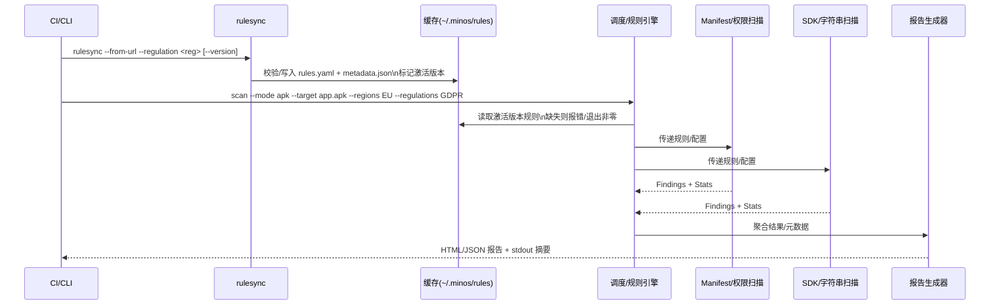
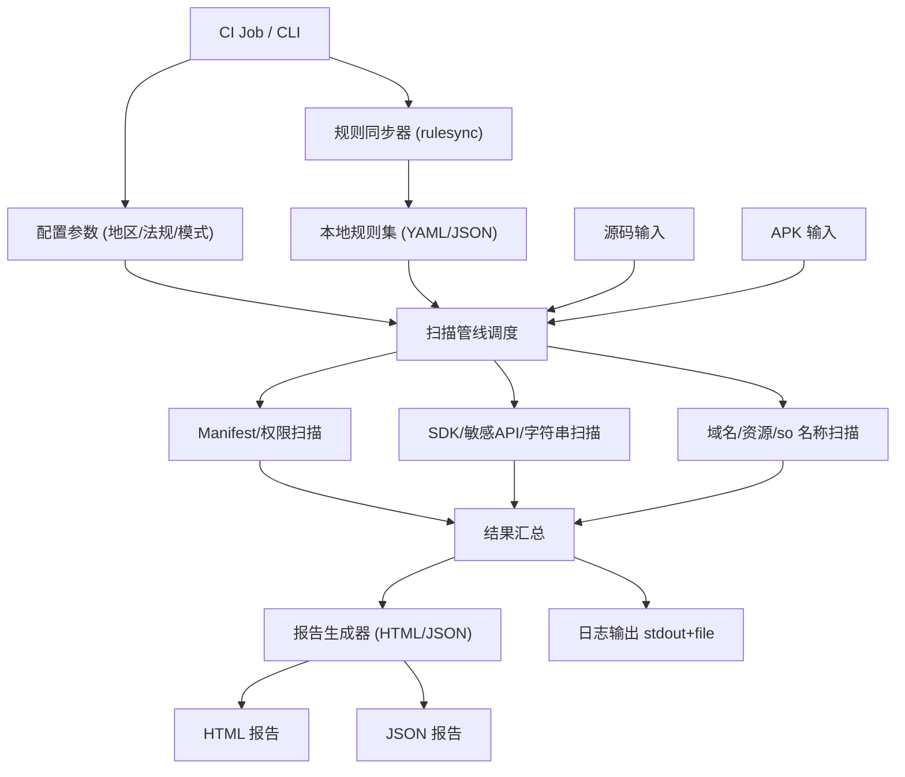

# Architecture for Minos 隐私合规扫描程序

Status: Approved

## Technical Summary

Minos 由数据驱动的规则引擎、静态扫描器（源码/APK）、报告生成器和规则同步器组成，通过 CLI/容器在 CI 中运行，输出 HTML/JSON 报告，并记录日志摘要。规则以 YAML/JSON 管理，可从受控仓库拉取更新，支持地区→法规映射与手动增删。

## 组件边界与时序



- 状态机：rulesync 下载→验证→写缓存→激活指针更新；失败回滚到上次激活版本，记录 error。扫描阶段规则缺失、解析失败、部分扫描器异常均需 fail-fast（非零退出码），并在 stdout 标明缺失模块。

## Technology Table

| Technology | Description |
| ---------- | ----------- |
| Python 3.10+ | 主要编排语言，CLI、规则加载、扫描管线调度、报告生成 |
| Androguard/jadx | APK/DEX/Manifest 静态解析（权限、导出组件、字符串、常量池） |
| Frida/mitmproxy（预留） | 动态检测接口预留，后续迭代启用 |
| Jinja2/模板引擎 | HTML 报告渲染 |
| YAML/JSON | 规则定义、配置与输出格式 |
| Docker/OCI 镜像 | CI/CD 交付形态，便于隔离依赖 |

## Architectural Diagrams



## Data Models, API Specs, Schemas, etc...

### 规则同步（单一入口 + 默认 URL 映射）

- CLI 入口：`rulesync --from-url --regulation <reg> [--version <ver>]`，参数可选且值不区分大小写；未给 URL 按法规自动填充 PRD “法规参考链接”默认地址（gdpr/ccpa-cpra/lgpd/pipl/appi），未给 regulation 时默认同步 PRD 列出的全部法规，仅白名单域名。  
- 安全默认：本地文件/导入 YAML/非白名单源默认禁用；需显式 `--allow-local-sources` 或 `--allow-custom-sources` 才放开，打印警示。  
- 存储结构：按法规与版本隔离 `~/.minos/rules/<regulation>/<version>/rules.yaml + metadata.json`，版本激活指针记录当前生效版本。`--version` 可选，未提供使用默认标识。  
- 流程：下载→站点适配器转换为 YAML（内部模块，不对外暴露独立命令）→ 写入缓存与 metadata → 激活；支持离线模式使用已缓存版本，校验 SHA256/可选签名。

### 扫描规则加载与执行

- 规则来源：默认从缓存目录 `~/.minos/rules/<reg>/<version>/rules.yaml` 加载（参数值大小写不敏感）；未指定法规时默认使用 PRD “法规参考链接”列出的全部法规。支持通过 `--rules-dir` 覆盖默认缓存根目录。  
- 规则驱动：Manifest/SDK 等扫描器从 YAML 载入匹配逻辑，支持禁用/覆盖与默认兜底规则；规则缺失/缓存缺失需明确报错并返回非零退出码。  
- 扫描 CLI（后续实现）：按地区/法规选择规则集→加载合并→调用 Manifest/SDK 扫描→生成报告与统计。

### 规则/报告 Schema 与版本策略

- 规则 schema（YAML）：`id`(必填/唯一)、`title`、`severity`(enum high/medium/low/info)、`regulation`、`region_source`、`category`、`matchers`(类型 manifest|api|string|domain，字段含 `pattern`、`file_glob`、`api_sig`、`logic` 等)、`recommendation`、`references`。使用 JSON Schema 定义 + 版本号（`rules_schema_version: 1`）并在 rulesync 下载后校验。  
- 兼容策略：小版本向后兼容；大版本在 metadata.json 标记 `breaking: true`，默认拒绝自动激活，需 `--allow-breaking`。  
- 报告 JSON schema：包含 `schema_version`（起始 v1），`meta`、`findings`、`stats` 字段固定；新增字段保持向后兼容，HTML 渲染需容错。  
- 条款映射：法规条款/参考链接在 rules.yaml 的 `references` 数组携带，报告中按 `rule_id` 透传，便于展示。

### 安全与信任链

- 来源控制：仅允许白名单域名；非白名单/本地文件需显式 `--allow-custom-sources`/`--allow-local-sources`，日志高亮警告。  
- 完整性：下载后校验 SHA256，若提供签名则用内置公钥验签；缓存记录 `sha256`、`downloaded_at`、`activated_at`。  
- 回滚：激活失败/校验失败回滚到上一激活版本，激活指针原子写。  
- 隐私与日志：报告避免持久化敏感字符串，日志 info 级脱敏（截断哈希），`--debug` 才输出细节。  
- 权限隔离：容器镜像非 root 运行；规则缓存目录使用用户级权限，避免系统全局写入。

### 性能与扩展性

- 并发：文件/模块级并行（Manifest 与 SDK 可并发），提供 `--max-workers`，默认 CPU 核数；限制高成本正则回溯。  
- 资源与超时：单目标软超时（如 300s）并标记 partial；CI 建议 2-4 vCPU、4-8GB 内存。  
- 缓存：复用规则版本缓存与 APK 解析中间结果（Manifest AST 等），命中条件为文件哈希一致。  
- 插件扩展：动态检测插件预留 gRPC/本地进程接口，约定输入（规则/目标路径）与输出（findings 列表），后续版本保持兼容。

### 可观测性与运维

- 日志：结构化 JSON 行，含 `timestamp`、`level`、`module`、`event`、`target`、`regulations`、`rule_id`；支持 `--log-file` 与轮转。  
- 指标：扫描耗时、规则加载耗时、规则命中数、失败率、缓存命中率，输出 stdout 摘要；容器可暴露 Prometheus 文本。  
- 告警：CI 失败条件包括规则加载失败、schema 校验失败、严重级别发现超阈值（可配置），退出码区分。  
- 故障恢复：下载失败→重试+回滚；规则缺失→直接 fail；扫描器异常→标记模块失败并 fail-fast；报告生成失败→保存中间 JSON 供排查。

### 配置与交付形态

- CLI 参数矩阵（示例）：`scan --mode [apk|src] --target <path> --regions EU --regulations GDPR --rules-dir <dir> --output out/ --format [html|json|both] --max-workers 4 --offline --log-file <file> --allow-custom-sources`。  
- 默认路径：规则缓存 `~/.minos/rules`，报告输出 `./output`，日志默认 stdout。  
- 镜像：基于 Python 3.10 slim，预装依赖；入口为 `minos scan ...`；允许挂载规则缓存卷。  
- 依赖锁定：`requirements.txt` + `constraints` 固定 androguard/jadx 版本，避免解析偏差。

### 测试与验证策略

- TDD：先写规则 schema 校验、规则加载单测、扫描器匹配用例（正/反例 APK/Manifest 样本）、报告生成快照，再实现功能。  
- 样本库：`tests/fixtures/apk/` 存放最小可复现 APK/Manifest，更新需记录期望 findings 基线。  
- 集成测试：CLI 端到端（含离线模式与缓存回滚场景），对比生成 JSON 与基线。  
- 兼容性：法规组合、缺省法规、大小写不敏感、破坏性版本拒绝激活等边界用例覆盖。

### 扫描结果数据模型（简要）

```json
{
  "meta": {
    "target": "app-release.apk",
    "mode": "apk",
    "regions": ["EU", "US-CA"],
    "regulations": ["GDPR", "CCPA/CPRA"],
    "ruleset_version": "v1.0.0",
    "tool_version": "v1.0.0",
    "timestamp": "2024-01-01T00:00:00Z"
  },
  "findings": [
    {
      "rule_id": "MANIFEST_EXPORT_001",
      "regulation": "GDPR",
      "region_source": "EU",
      "severity": "high",
      "location": "AndroidManifest.xml:45",
      "evidence": "exported=true component: com.example.ExposedActivity",
      "recommendation": "将组件设为非导出或增加权限保护"
    }
  ],
  "stats": {
    "count_by_severity": {"high": 1, "medium": 0, "low": 0},
    "count_by_regulation": {"GDPR": 1}
  }
}
```

### 核心组件

- 规则同步器（rulesync）：从受控仓库拉取/校验规则包，支持离线缓存与回滚。
  - 在线同步：默认同步“法规参考链接”中的全部法规，可通过参数指定法规子集；每个法规单独存储于 `~/.minos/rules/<regulation>`，仅保留最新版本。
- 规则引擎：解析 YAML/JSON 规则，编译匹配器（正则/AST/清单节点等）。
- 静态扫描器：
  - Manifest/权限与导出组件检查
  - SDK/敏感 API/字符串扫描
  - 域名/资源/so 名称轻量分析
- 报告生成器：合成 HTML+JSON 报告，附统计摘要与条款链接；stdout 输出摘要。
- 日志与监控：info/debug/error，文件与 stdout，支持轮转配置。

### 部署/交付

- 本地可直接运行（Python 环境安装依赖后使用 CLI），也可在 CI 通过 Docker/OCI 镜像运行；支持无网模式使用本地规则缓存。
- 预留动态检测插件接口（Frida/mitmproxy），后续迭代可接入。
