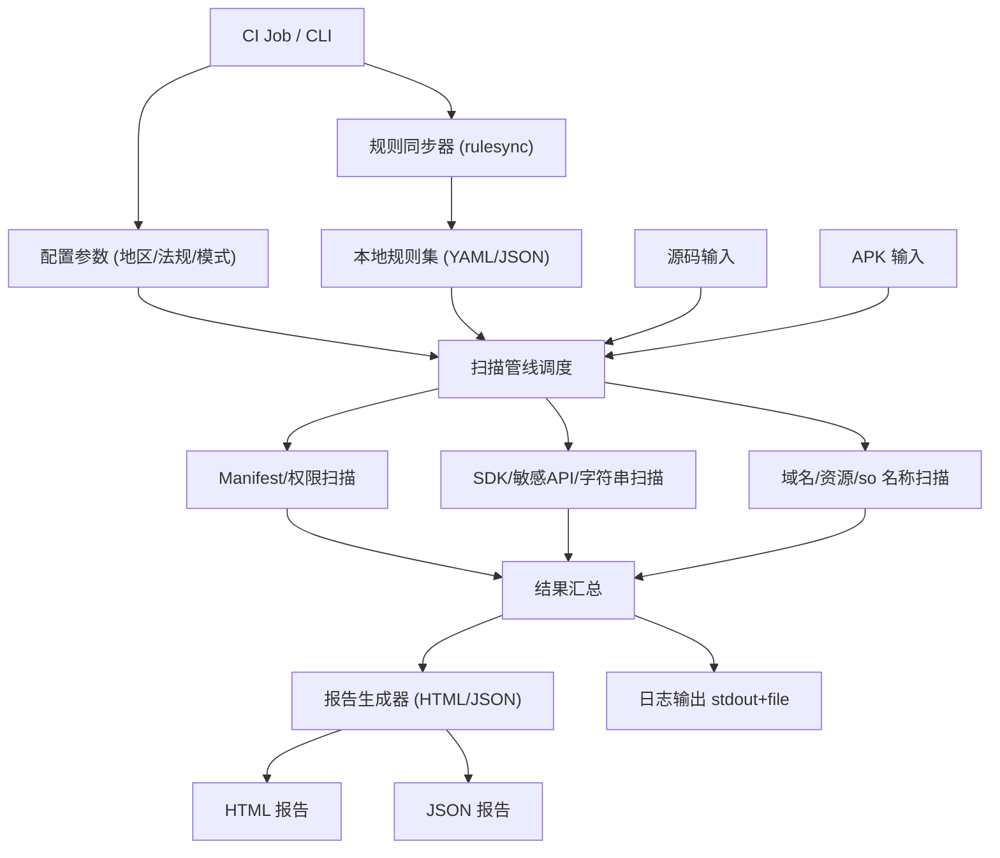

# Architecture for Minos 隐私合规扫描程序

Status: Approved

## Technical Summary

Minos 由数据驱动的规则引擎、静态扫描器（源码/APK）、报告生成器和规则同步器组成，通过 CLI/容器在 CI 中运行，输出 HTML/JSON 报告，并记录日志摘要。规则以 YAML/JSON 管理，可从受控仓库拉取更新，支持地区→法规映射与手动增删。

## Technology Table

| Technology | Description |
| ---------- | ----------- |
| Python 3.10+ | 主要编排语言，CLI、规则加载、扫描管线调度、报告生成 |
| Androguard/jadx | APK/DEX/Manifest 静态解析（权限、导出组件、字符串、常量池） |
| Frida/mitmproxy（预留） | 动态检测接口预留，后续迭代启用 |
| Jinja2/模板引擎 | HTML 报告渲染 |
| YAML/JSON | 规则定义、配置与输出格式 |
| Docker/OCI 镜像 | CI/CD 交付形态，便于隔离依赖 |

## Architectural Diagrams



## Data Models, API Specs, Schemas, etc...

### 规则同步（在线与本地缓存）

- 在线源：直接使用 PRD “法规参考链接” 中的官方地址（https/git/oci），rulesync 默认同步全部法规（GDPR、CCPA/CPRA、LGPD、PIPL、APPI 等），支持 `--regulations` 指定子集。  
- 本地存储：按法规隔离目录 `~/.minos/rules/<regulation>`，仅保留最新版本（覆盖旧版），法规间互不覆盖，可并行存在。  
- 校验与模式：下载后校验完整性（SHA256/可选签名），支持离线模式读取已缓存版本。

### 扫描结果数据模型（简要）

```json
{
  "meta": {
    "target": "app-release.apk",
    "mode": "apk",
    "regions": ["EU", "US-CA"],
    "regulations": ["GDPR", "CCPA/CPRA"],
    "ruleset_version": "v1.0.0",
    "tool_version": "v1.0.0",
    "timestamp": "2024-01-01T00:00:00Z"
  },
  "findings": [
    {
      "rule_id": "MANIFEST_EXPORT_001",
      "regulation": "GDPR",
      "region_source": "EU",
      "severity": "high",
      "location": "AndroidManifest.xml:45",
      "evidence": "exported=true component: com.example.ExposedActivity",
      "recommendation": "将组件设为非导出或增加权限保护"
    }
  ],
  "stats": {
    "count_by_severity": {"high": 1, "medium": 0, "low": 0},
    "count_by_regulation": {"GDPR": 1}
  }
}
```

### 核心组件

- 规则同步器（rulesync）：从受控仓库拉取/校验规则包，支持离线缓存与回滚。
  - 在线同步：默认同步“法规参考链接”中的全部法规，可通过参数指定法规子集；每个法规单独存储于 `~/.minos/rules/<regulation>`，仅保留最新版本。
- 规则引擎：解析 YAML/JSON 规则，编译匹配器（正则/AST/清单节点等）。
- 静态扫描器：
  - Manifest/权限与导出组件检查
  - SDK/敏感 API/字符串扫描
  - 域名/资源/so 名称轻量分析
- 报告生成器：合成 HTML+JSON 报告，附统计摘要与条款链接；stdout 输出摘要。
- 日志与监控：info/debug/error，文件与 stdout，支持轮转配置。

### 部署/交付

- 本地可直接运行（Python 环境安装依赖后使用 CLI），也可在 CI 通过 Docker/OCI 镜像运行；支持无网模式使用本地规则缓存。
- 预留动态检测插件接口（Frida/mitmproxy），后续迭代可接入。
