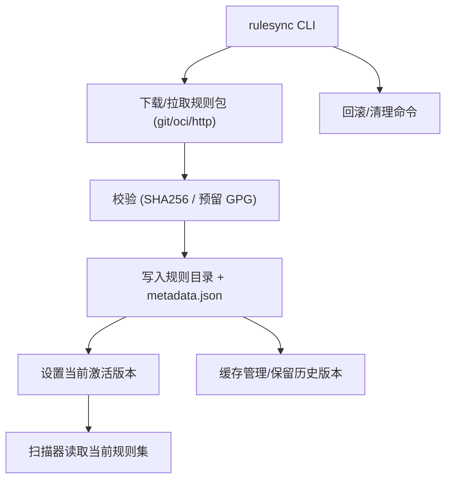

# Epic-1 - Story-1
# 规则同步与版本管理（rulesync）

**As a** 合规工具使用者/CI 运维  
**I want** 能从受控仓库拉取并校验规则包，支持缓存与回滚  
**so that** 扫描时始终使用可信且可追溯的规则集

## Status

Draft

## Context

- 本故事隶属 Epic-1（规则供应与版本管理），是后续地区映射与扫描的前置。  
- 规则包需支持版本号与签名校验（SHA256，可选 GPG），来源为受控仓库（git/OCI）。  
- 需支持离线/受限网络：本地缓存可复用，显式更新或清理。  
- PRD 要求：CLI 触发同步/更新，记录规则来源与版本，供扫描与报告引用。

## Estimation

Story Points: 2

## Tasks

1. - [ ] 设计并实现 rulesync CLI（参数：源仓库、版本/标签、签名校验开关、缓存目录）  
   1. - [ ] 支持 https/git/oci 拉取规则包并解压到本地目录（默认 `~/.minos/rules` 可配置）  
   2. - [ ] 校验规则包完整性（SHA256，预留 GPG 验证）并写入 metadata（版本、来源、校验结果、时间戳）  
   3. - [ ] 失败与重试策略（网络/校验失败时的错误提示与退出码）  
2. - [ ] 缓存与回滚机制  
   1. - [ ] 维护本地规则版本列表与当前激活版本指针  
   2. - [ ] 提供回滚到上一个版本的命令/参数  
   3. - [ ] 清理旧版本/缓存的命令（限额或按版本数）  
3. - [ ] 与扫描器集成的接口输出  
   1. - [ ] 在规则目录生成 machine-readable 的 metadata.json（包含版本、签名、来源 URL、生成时间）  
   2. - [ ] 扫描器可读取当前激活版本路径并校验存在性  
4. - [ ] 日志与可观测性  
   1. - [ ] stdout 摘要（拉取版本、校验结果、安装路径）；文件日志记录详细步骤  
   2. - [ ] 退出码约定（成功=0，校验失败/拉取失败为非零码）
5. - [ ] 文档与验收  
   1. - [ ] 更新 README/使用说明，示例命令（在线/离线）  
   2. - [ ] 验收用例：拉取成功、校验失败、回滚、离线使用缓存

## Constraints

- 默认不启用网络上传；仅本地拉取/校验与缓存管理。  
- 规则目录需兼容无网/受限网络环境。  
- 保持与 PRD 版本/签名校验要求一致。

## Data Models / Schema

- `metadata.json`（示例）：

```json
{
  "version": "v1.0.0",
  "source": "https://example.com/rules.git",
  "sha256": "<digest>",
  "gpg": "optional",
  "installed_at": "2024-01-01T00:00:00Z",
  "active": true
}
```

## Structure

- `cli/`：rulesync 入口与参数解析  
- `rulesync/`：下载/校验/解压/缓存管理模块  
- `rules/`（可配置路径，默认 `~/.minos/rules`）：规则包存放与 metadata

## Diagrams



## Dev Notes

- 预留 GPG 校验接口，但首版可仅实现 SHA256。  
- 考虑大包/慢网时的超时与重试策略；必要时支持断点续传或重拉。  
- 日志需包含来源、版本、校验摘要，方便审计与问题定位。

## Chat Command Log

- User: 现在，参考 template-story.md ，起草首个故事  
- Assistant: 起草 Story-1（rulesync），草稿待审阅
