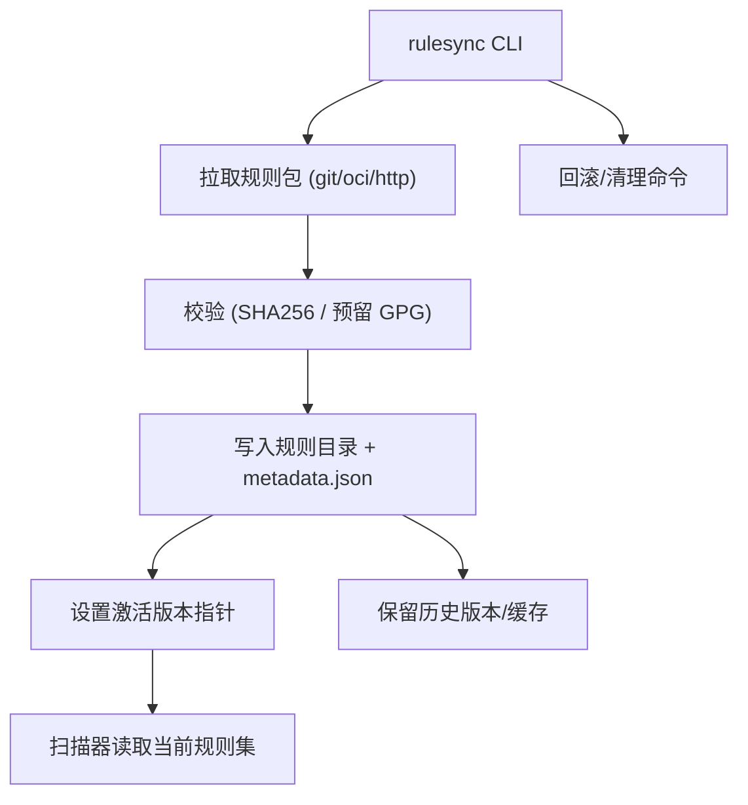

# Epic-1 - Story-1
# 规则同步与版本管理（rulesync）

**As a** 合规工具使用者/CI 运维  
**I want** 通过 CLI 从受控仓库拉取并校验规则包，支持缓存与回滚  
**so that** 扫描时始终使用可信、可追溯且可恢复的规则集

## Status

Approved

## Context

- Epic-1（规则供应与版本管理）是其他功能的前置：只有规则可用且可信，后续地区映射与扫描才有意义。  
- 规则包需有版本号与签名（SHA256，预留 GPG），来源为受控仓库（git/OCI/https），支持离线/受限网络使用缓存。  
- PRD 约束：记录规则来源和版本，供扫描与报告引用；支持 CLI 同步、缓存、回滚；不上传数据。

## Estimation

Story Points: 2

## Tasks

1. - [x] 设计测试用例（TDD 先行）  
   - [x] 1.1 覆盖：拉取成功、校验失败、离线用缓存、回滚、切换版本、metadata 输出、退出码与日志行为  
   - [x] 1.2 明确断言：metadata 字段、缓存目录结构、激活版本指针、错误提示与退出码  
2. - [x] 实现测试用例（自动化）  
   - [x] 2.1 根据测试计划编写可运行的测试用例（拉取/校验/缓存/回滚/切换/错误场景）  
   - [x] 2.2 支持本地与 CI 运行，产出断言清晰、可重复执行（已在 .venv 下运行：`PYTHONPATH=src .venv/bin/pytest -q`，通过 5/5）
3. - [x] 设计并实现 rulesync CLI  
   - [x] 3.1 参数：源仓库（git/oci/https）、版本/标签、签名校验开关、缓存目录（默认 `~/.minos/rules` 可配）  
   - [x] 3.2 拉取并解压规则包；校验 SHA256（预留 GPG）；写入 metadata（版本、来源、校验结果、时间戳）  
   - [x] 3.3 失败与重试策略（网络/校验失败的错误提示与非零退出码）  
4. - [x] 缓存与回滚机制  
   - [x] 4.1 维护规则版本列表与激活版本指针  
   - [x] 4.2 提供回滚到上一版本/指定版本的命令或参数  
   - [x] 4.3 清理旧版本/缓存（限额或按版本数）  
5. - [ ] 与扫描器的接口输出  
   - [x] 5.1 生成 machine-readable 的 metadata.json（版本、签名、来源 URL、生成时间、激活标记）  
   - [x] 5.2 输出当前激活规则路径供扫描器读取并校验存在性  
6. - [ ] 日志与可观测性  
   - [ ] 6.1 stdout 摘要（拉取版本、校验结果、安装路径）；文件日志记录详细步骤  
   - [ ] 6.2 退出码约定：成功=0，校验失败/拉取失败=非零  
7. - [ ] 文档与验收  
   - [ ] 7.1 使用说明与示例命令（在线/离线、回滚、清理）  
   - [ ] 7.2 验收用例：拉取成功、校验失败、回滚、离线使用缓存、切换版本

## Constraints

- 默认不上传任何数据；仅本地拉取/校验/缓存。  
- 需兼容无网/受限网络环境，使用本地缓存。  
- 保持与 PRD 对规则版本、签名校验的要求一致。

## Data Models / Schema

- `metadata.json` 示例：

```json
{
  "version": "v1.0.0",
  "source": "https://example.com/rules.git",
  "sha256": "<digest>",
  "gpg": "optional",
  "installed_at": "2024-01-01T00:00:00Z",
  "active": true
}
```

## Structure

- `cli/`：rulesync 入口与参数解析  
- `rulesync/`：下载/校验/解压/缓存管理模块  
- `rules/`（可配置，默认 `~/.minos/rules`）：规则包存放与 metadata

## Diagrams



## Dev Notes

- GPG 校验接口预留，首版可仅实现 SHA256；考虑慢网/大包的超时与重试策略。  
- 日志需包含来源、版本、校验摘要，便于审计；确保退出码可被 CI 使用。  
- TDD：先落地测试用例与断言，再实现 CLI 与逻辑。

## Test Plan

- 拉取成功（git/https 示例源），校验通过，metadata 正确写入（版本、来源、sha256、时间戳、active=true），退出码=0，stdout 摘要包含路径。  
- 校验失败（伪造校验值）：安装失败，退出码非零，错误信息明确，不写入 active 版本。  
- 离线用缓存：无网络时使用已缓存版本，提示使用缓存，退出码=0。  
- 回滚：存在两个版本时回滚到前一版本，active 指针更新，metadata 记录切换。  
- 切换版本：指定新版本成功安装并激活，旧版本保留在缓存列表。  
- 缺少输入/无效源：清晰错误提示，退出码非零，不写入缓存。  
- metadata 文件校验：字段齐全且与实际文件结构/路径一致。  
- 日志与退出码：stdout 摘要含版本/路径/校验结果，文件日志记录步骤，退出码约定生效。  

## Chat Command Log

- User: 重新生成 story 1  
- Assistant: 重写 Story-1（规则同步与版本管理）草稿
