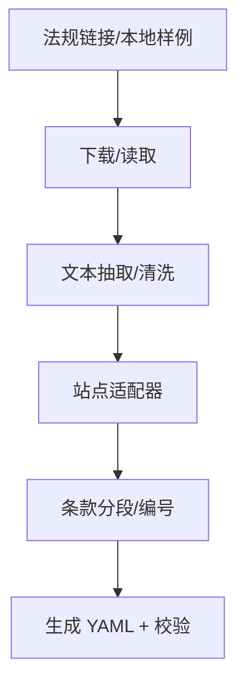

# Epic-1 - Story-10
# 法规文档转换：通用框架 + 站点适配器（无 LLM）

**As a** 合规规则维护者/发布者  
**I want** 针对法规参考链接的 HTML/PDF 文档进行规则化抽取并生成 YAML  
**so that** 可以在不依赖 LLM 的前提下自动生成可导入的规则集

## Status

Approved

## Context

- 需求确认：不使用 LLM，通过“通用框架 + 站点适配器”完成法规文档到 YAML 的转换。  
- 适配范围约定：默认英文；不支持则使用页面默认语言。支持 HTML/PDF，仅抽取“正文条款”，不含附件/目录/索引。  
- 需覆盖法规参考链接：GDPR/CCPA/CPRA/LGPD/PIPL/APPI。  
- 输出字段要求：见 PRD 的“法规文档转换输出字段（建议）”。

## Estimation

Story Points: 2

## Tasks

1. - [ ] 设计测试用例（TDD 先行）  
   - [x] 1.1 覆盖：HTML 站点解析（GDPR/CCPA/LGPD 等）条款分段与标题识别  
   - [ ] 1.2 覆盖：PDF 解析路径（能提取条款编号/标题/正文）  
   - [ ] 1.3 覆盖：语言回退（无英文时使用页面默认语言）  
   - [ ] 1.4 覆盖：输出 YAML 字段完整性与 schema 校验  
   - [ ] 1.5 覆盖：站点结构变化导致解析失败的错误定位信息  
   - [ ] 1.6 覆盖：未知法规/站点（不在 PRD 列表）时直接失败并提示需扩展适配器  
2. - [ ] 实现测试用例（自动化）  
   - [ ] 2.1 站点适配器单测（基于本地样例 HTML/PDF）  
   - [ ] 2.2 通用框架集成测试（输入样例 -> 输出 YAML）  
   - [ ] 2.3 未匹配适配器的失败路径测试（错误码/错误消息）  
3. - [ ] 实现通用框架  
   - [ ] 3.1 下载/读取模块（HTML/PDF，支持本地样例输入）  
   - [ ] 3.2 文本抽取与分段（基于条款编号与标题）  
   - [ ] 3.3 YAML 生成与 schema 校验  
   - [ ] 3.4 适配器选择与回退逻辑（无匹配时直接失败并提示需扩展）  
4. - [ ] 实现站点适配器  
   - [ ] 4.1 GDPR（eur-lex）适配  
   - [ ] 4.2 CCPA/CPRA（leginfo）适配  
   - [ ] 4.3 LGPD（planalto）适配  
   - [ ] 4.4 PIPL（epicor）适配  
   - [ ] 4.5 APPI（ppc）适配  
5. - [ ] 文档与验收  
   - [ ] 5.1 README/使用说明补充“法规文档转换”示例  
   - [ ] 5.2 记录适配范围与已支持站点列表  
   - [ ] 5.3 说明未支持法规/站点的报错行为与扩展方式  

## Constraints

- 不使用 LLM。  
- 默认英文；不支持英文则使用页面默认语言。  
- 仅抽取正文条款，不含附件/目录/索引。  
- 解析失败需给出可定位的错误信息。
- 仅支持 PRD 中列出的已知法规站点（GDPR/CCPA/CPRA/LGPD/PIPL/APPI）；遇到未知法规/地区的本地文档或在线链接应直接失败并提示需扩展适配器。

## Data Models / Schema

- 输出字段（建议）：  
  - 必填：rule_id、regulation、title、clause、description、source_url、version  
  - 可选：severity（默认 medium）、pattern、evidence、recommendation、confidence（0~1）、issues（字符串数组）

## Structure

- `src/minos/rulesync/`：通用框架与站点适配器  
- `tests/test_rulesync_convert.py`：转换与适配器测试  
- `fixtures/`：站点样例 HTML/PDF（本地）

## Diagrams

## Dev Notes

- 通用框架只负责流程控制与通用抽取；站点适配器负责结构化解析细节。  
- 输出字段缺失需记录 issues 并提供定位信息（条款/节点/页面来源）。  
- 适配器设计遵循开闭原则：  
  - 通过适配器接口定义 `matches(url)`、`extract(content, source_url)`、`normalize(segments)`。  
  - 核心框架只依赖接口与注册表；新增站点仅添加适配器与配置映射。  
  - 支持注册发现机制（配置或 entrypoints），无匹配适配器时回退通用解析并输出提示。  
  - 适配器只处理站点结构解析，不负责落地与缓存。  
  - 适配器必须配套本地样例测试，便于结构变更时定位问题。  

## Test Plan（设计补充）

- HTML 适配器条款分段与标题识别  
  - GDPR (eur-lex) HTML 样例：包含连贯的章节号/条款标题（如 Article 5, 6），断言生成的规则列表按条款编号分段，title 取条款标题，clause=编号，source_url=输入 URL。  
  - CCPA/CPRA (leginfo) HTML 样例：章节号包含小节（例如 1798.100 / 1798.100(a)），断言分段保留层级，title 抽取条款标题或首句。  
  - LGPD (planalto) HTML 样例（葡语页面）：确认在默认语言下仍可按条款编号分段，title 不存在时用条款首句回填。  
  - 负例：HTML 中混入附录/目录节点，适配器应忽略附录/目录，不生成规则；遇到缺失编号的段落直接跳过并在日志中提示。  

## Chat Command Log

- User: 起草 story（通用框架 + 站点适配器，法规文档转换，无 LLM）
