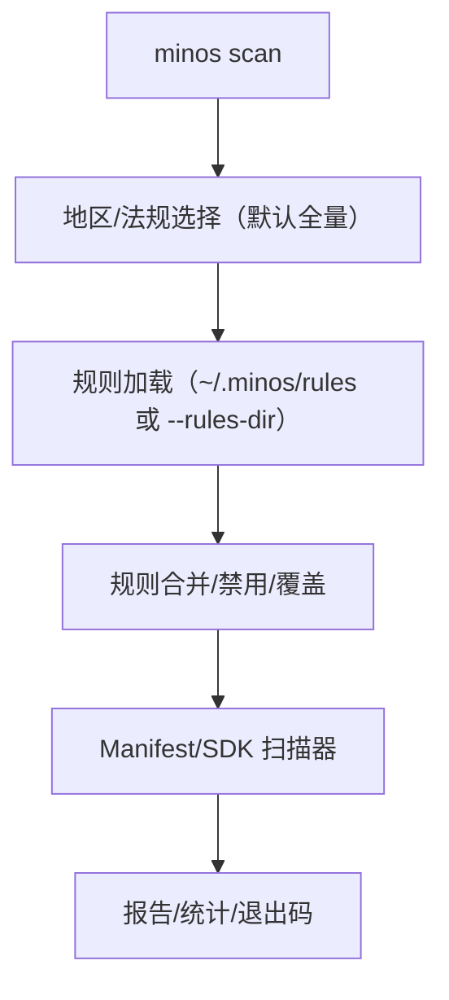

# Epic-3 - Story-12
# CLI 扫描加载缓存规则并执行 Manifest/SDK 扫描

**As a** CI/本地用户  
**I want** `minos scan` 自动从规则缓存（或指定目录）加载法规规则并执行 Manifest/SDK 扫描  
**so that** 无需手工传规则即可按法规/地区完成扫描并输出报告

## Status

Draft

## Context

- 底层扫描器已支持 YAML 驱动（Manifest/SDK），但 CLI `scan` 仍为占位，未接入规则缓存。  
- PRD 要求：默认从 `~/.minos/rules/<reg>/<version>/rules.yaml` 加载，参数值大小写不敏感；未指定法规时默认使用 PRD “法规参考链接”列出的全部法规；规则缺失需报错非零退出；支持 `--rules-dir` 覆盖默认缓存目录。  
- 需在 CLI 中串联：地区/法规映射 → 规则加载/合并 → 执行 Manifest/SDK 扫描 → 报告/退出码。

## Estimation

Story Points: 3

## Tasks

1. - [ ] 设计测试用例（TDD 先行）  
   - [x] 1.1 场景覆盖：默认法规（未传 regulations/regions）加载 PRD 全部法规；指定法规/地区（大小写混用）加载对应规则；`--rules-dir` 覆盖默认路径；规则/缓存缺失时报错非零；规则禁用/覆盖生效；Manifest+SDK 扫描结合输出报告。  
   - [ ] 1.2 断言：退出码、stdout 摘要、报告生成、stats/metadata 中的法规/版本信息、错误提示（缺规则/未映射）。  

2. - [ ] 实现测试用例  
   - [ ] 2.1 按 1.x 编写自动化测试（可用 mock 规则目录与简易样例文件），覆盖成功/失败/覆盖/禁用/规则缺失/规则目录覆盖等场景。  

3. - [ ] 功能实现  
   - [ ] 3.1 CLI 解析：新增 `--rules-dir`（覆盖默认缓存根），法规/地区参数大小写不敏感，未指定法规时使用 PRD 全量列表。  
   - [ ] 3.2 规则加载：从 `<rules_dir>/<reg>/<version>/rules.yaml` 读取（version 取 active/default 或参数），合并同法规多源规则，支持禁用/覆盖；规则缺失时报错非零。  
   - [ ] 3.3 扫描执行：调用 manifest_scanner/sdk_scanner，生成 JSON/HTML 报告与 stats，stdout 输出摘要。  

4. - [ ] 文档与验收  
   - [ ] 4.1 更新 README/CI/容器文档，说明 scan 默认从缓存加载规则、支持 `--rules-dir` 覆盖、法规默认全量、大小写不敏感、规则缺失错误。  
   - [ ] 4.2 更新 PRD/变更记录，补充 CLI scan 规则加载行为与参数。  
   - [ ] 4.3 验收用例：最小命令成功（默认法规加载）、指定法规/目录、规则缺失报错、禁用/覆盖生效、报告输出检查。

## Constraints

- 参数值不区分大小写；未指定法规默认使用 PRD 法规参考链接列表。  
- 默认规则目录 `~/.minos/rules`，可通过 `--rules-dir` 覆盖；规则/缓存缺失需报错非零。  
- 规则需按法规/版本隔离加载，可合并多法规规则（并集）；禁用/覆盖生效。  
- 保持现有扫描器 YAML 驱动，不引入 LLM。

## Data Models / Schema

- 规则目录：`<rules_dir>/<reg>/<version>/rules.yaml` + `metadata.json`（version/source_url/installed_at/active）。  
- 报告：包含 meta（regulations/regions/ruleset_version）、findings/stats；退出码 0/非零按成功/失败。

## Structure

- CLI 层新增规则加载与调度；重用 manifest_scanner/sdk_scanner；默认规则目录常量。

## Diagrams

## Dev Notes

- 规则缺失需早失败，避免空扫描；stdout 摘要包含法规列表/规则路径。  
- 覆盖默认规则目录时，路径需支持绝对/相对，统一展开 `~`。  
- 可使用最简 YAML 规则 + 简易输入文件构造测试，加快运行。

## Test Plan

- 默认法规（无 regulations/regions）从缓存加载 PRD 全量法规成功，报告生成；退出码 0。  
- 指定法规（大小写混用）加载对应规则成功，报告 meta 中法规小写；退出码 0。  
- `--rules-dir` 指向自定义目录成功加载；路径展开 `~` 生效。  
- 规则/缓存缺失：退出码非零，stderr 提示缺规则/缓存。  
- 禁用/覆盖规则：同 rule_id 覆盖前值，disabled 不生效；扫描命中按覆盖后规则。  
- Manifest+SDK 综合：命中示例规则，报告 stats 与 findings 匹配。  
