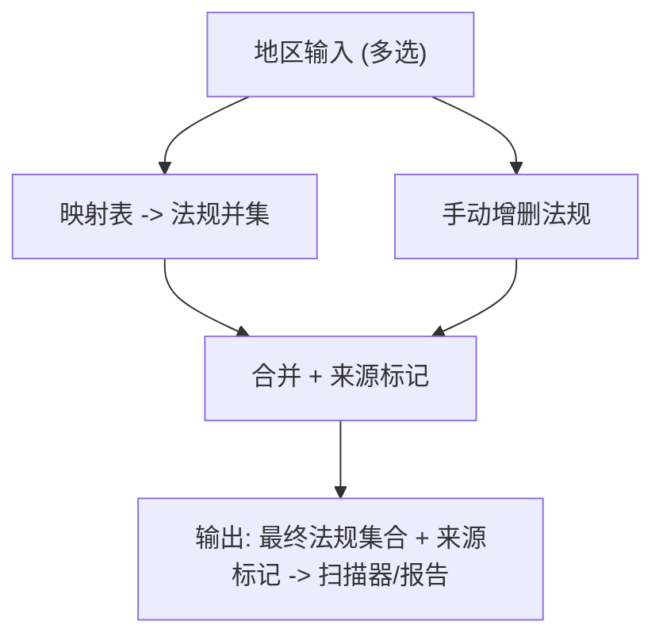

# Epic-2 - Story-1
# 地区→法规映射配置与高级选择

**As a** 合规/产品配置人员  
**I want** 在 UI/配置中按地区多选自动映射法规，并可手动增删法规，报告标注来源  
**so that** 扫描规则集与发布地区保持一致，且支持高级定制

## Status

Approved

## Context

- Epic-2 聚焦地区/法规映射，是扫描入口前置：先确定地区→法规集合，再加载规则。  
- PRD 要求：UI 默认多选地区自动映射法规，提供高级模式手动增删；报告标注规则来源（地区映射/手动）。  
- 需支持可扩展地区列表和法规列表；并集策略：地区多选时法规取并集，手动调整后以最终选择为准。

## Estimation

Story Points: 2

## Tasks

1. - [x] 设计测试用例（TDD 先行）  
   - [x] 1.1 覆盖：单地区映射、多地区并集、手动增删法规、默认列表加载、报告来源标记、无效输入/缺省处理  
   - [x] 1.2 定义断言：映射结果、最终法规集合、来源标记字段、配置持久化/读取、错误提示  
2. - [x] 实现测试用例（自动化）  
   - [x] 2.1 编写映射/手动调整/无效输入等场景的测试，含来源标记断言  
   - [x] 2.2 支持本地与 CI 运行，输出明确的断言与退出码（pytest -q 全部通过）
3. - [x] 实现地区/法规数据源加载  
   - [x] 3.1 加载可选地区与默认映射表（支持扩展/覆盖）  
   - [x] 3.2 加载可选法规集合，支持自定义扩展  
4. - [x] 组合逻辑与 API/配置接口  
   - [x] 4.1 输入：地区列表、多选，返回映射法规并集  
   - [x] 4.2 高级模式：手动增删法规，输出最终法规集合与来源标记（映射/手动）  
   - [x] 4.3 配置持久化/读取（如 config 文件或 CLI 参数解析）  
5. - [x] 报告与下游接口  
   - [x] 5.1 将地区/法规选择结果和来源标记输出给扫描器/报告生成器  
   - [x] 5.2 报告字段：地区列表、法规列表、来源标记（地区映射/手动）  
6. - [x] 日志与校验  
   - [x] 6.1 stdout 摘要：选定地区、映射法规、手动调整结果  
   - [x] 6.2 对缺失/无效地区或法规给出清晰错误/警告
7. - [ ] 文档与验收  
   - [x] 7.1 说明默认映射表、可扩展方式、示例配置/命令  
   - [x] 7.2 验收用例：单地区、多地区并集、手动添加法规、手动移除法规、报告标记检查

## Constraints

- 映射与手动调整的结果以最终并集为准；报告必须标注规则来源。  
- 支持无网/受限环境，映射表本地可配置。  
- 不上传任何数据。

## Data Models / Schema

- 映射配置示例（YAML/JSON）：

```json
{
  "regions": ["EU", "US-CA"],
  "regulations": ["GDPR", "CCPA/CPRA"],
  "overrides": ["LGPD"],
  "source_flags": {
    "GDPR": "region",
    "CCPA/CPRA": "region",
    "LGPD": "manual"
  }
}
```

## Structure

- `config/regions.json|yaml`：地区与默认映射表  
- `config/regulations.json|yaml`：法规列表（可扩展）  
- `mapping/`：映射与合并逻辑模块  
- `cli/`：配置读取与输出接口（与 rulesync/扫描器对接）

## Diagrams



## Dev Notes

- 保证映射表可扩展/覆盖，避免写死在代码中。  
- 来源标记需贯穿到报告与扫描加载阶段，便于审计。  
- TDD：先定义映射与合并的测试，再实现逻辑。

## Test Plan

- 单地区映射：输入 EU -> 输出法规集 {GDPR}，来源标记=region。  
- 多地区并集：输入 [EU, US-CA] -> 输出 {GDPR, CCPA/CPRA}，来源标记对应地区。  
- 手动增删法规：映射后手动添加/移除法规，最终集合正确，来源标记=manual。  
- 默认列表加载：可选地区/法规列表加载成功，可扩展/覆盖。  
- 无效输入/缺省：非法地区/法规给出错误或警告；缺省输入提示错误。  
- 报告来源标记：输出包含地区列表、法规列表、source_flags（region/manual），供扫描器/报告使用。  
- 配置持久化/读取：config 读写一致，覆盖 CLI 输入时行为明确。

## Assertions (for tests)

- 映射结果：地区输入 -> 法规并集与来源标记正确（region/manual）；手动增删后并集准确。  
- 默认列表：地区/法规可选列表加载成功，可覆盖/扩展，缺失项提示错误。  
- 持久化：配置写入/读取保持一致；CLI 参数覆盖配置时行为明确。  
- 错误处理：非法地区/法规、缺省输入时返回可预期错误/退出码；日志/提示清晰。

## Chat Command Log

- User: 生成下一个 story  
- Assistant: 起草 Epic-2 Story-1（地区→法规映射配置）草稿
