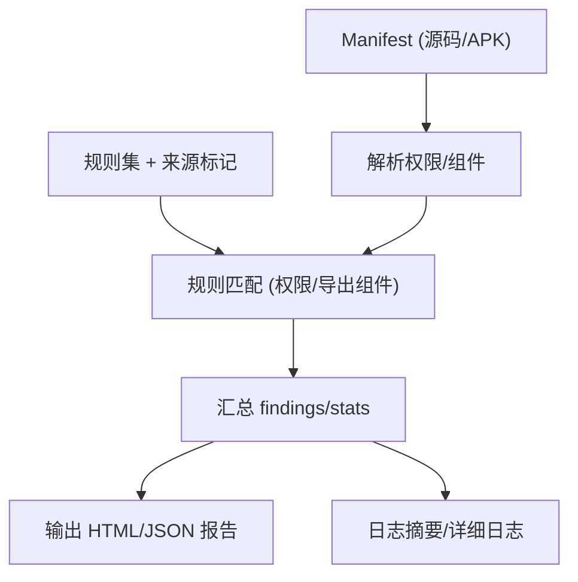

# Epic-3 - Story-1
# Manifest 与权限扫描

**As a** 隐私合规审查者/CI 用户  
**I want** 扫描 AndroidManifest 的权限与导出组件并按规则集输出风险  
**so that** 能及早发现过度索权或暴露组件的隐患

## Status

Approved

## Context

- Epic-3 聚焦静态扫描与规则引擎，本故事覆盖 Manifest/权限/导出组件检查。  
- 依赖：已完成规则供应（Epic-1）与地区/法规映射（Epic-2），获取规则并集作为扫描输入。  
- PRD 约束：报告需 HTML+JSON，标注法规与来源；日志输出摘要；支持本地/CI 运行。

## Estimation

Story Points: 2

## Tasks

1. - [x] 设计测试用例（TDD 先行）  
   - [x] 1.1 覆盖：必要性/敏感权限命中、导出组件命中、未命中、规则缺失、非法 Manifest 处理、映射来源标记透传  
   - [x] 1.2 断言：命中列表（rule_id、法规、来源标记）、位置（文件/行或组件名）、严重级别、退出码与日志（测试已编写，当前标记 xfail，等待实现）
2. - [x] 实现测试用例（自动化）  
   - [x] 2.1 编写解析/匹配/报告输出的测试用例，覆盖上述场景与断言（已实现 manifest_scanner 逻辑）  
   - [x] 2.2 支持本地与 CI 运行，验证退出码与日志内容（pytest -q 全部通过）  
3. - [x] Manifest 解析与输入处理  
   - [x] 3.1 支持 APK 解包与源码路径直接读取 Manifest  
   - [x] 3.2 处理多变体/多 manifest 合并策略（至少支持主 Manifest）  
4. - [x] 规则匹配实现  
   - [x] 4.1 权限规则匹配（必要性/敏感权限）  
   - [x] 4.2 导出组件规则匹配（activity/service/provider/exported 属性、权限保护）  
   - [x] 4.3 关联地区/法规来源标记（来自映射/手动）  
5. - [ ] 结果与报告集成  
   - [x] 5.1 输出 findings（rule_id、法规、来源、位置、证据、建议、严重级别）到 JSON/HTML  
   - [ ] 5.2 stats 汇总：按严重级别/法规计数  
6. - [ ] 日志与可观测性  
   - [ ] 6.1 stdout 摘要：扫描目标、命中计数、报告路径  
   - [ ] 6.2 详细日志：解析阶段、匹配阶段、错误与跳过原因  
7. - [ ] 文档与验收  
   - [ ] 7.1 示例命令（源码/ APK 输入）、预期报告片段  
   - [ ] 7.2 验收用例：必要权限命中、导出组件命中、无命中、异常 Manifest 处理、来源标记检查

## Constraints

- 不上传任何数据；兼容无网/受限环境。  
- 需与规则供应/映射输出的规则集与来源标记兼容。  
- 报告字段与 PRD/架构定义一致。

## Data Models / Schema

- findings 字段（示例）：

```json
{
  "rule_id": "PERM_SENSITIVE_LOCATION",
  "regulation": "PIPL",
  "source": "region",
  "severity": "high",
  "location": "AndroidManifest.xml:120",
  "evidence": "uses-permission: ACCESS_FINE_LOCATION",
  "recommendation": "仅在必要场景申请定位权限，确保前台提示与同意"
}
```

## Structure

- `scanner/manifest`：Manifest 解析与匹配模块  
- `scanner/common`：规则加载、结果汇总输出  
- `reports/`：HTML/JSON 输出目录（或 CLI 指定）

## Diagrams



## Dev Notes

- 若可用 mapping.txt，可提升定位（但此故事聚焦 Manifest）。  
- 对解析失败/缺失需给出清晰错误并不中断其他流程（除非无可用 Manifest）。  
- TDD：先写解析/匹配/输出的测试，再实现。

## Test Plan

- 必要性/敏感权限命中：Manifest 含敏感权限（如 ACCESS_FINE_LOCATION），命中对应规则，来源标记透传。  
- 导出组件命中：导出 activity/service/provider 无保护时命中规则。  
- 未命中：权限与导出配置均合规，结果为空。  
- 规则缺失：规则集为空或未加载时提示/退出码，日志清晰。  
- 非法 Manifest：无法解析或缺失时返回错误/退出码，不中断其他流程（可选跳过）。  
- 来源标记透传：输出 findings 包含 source=region/manual，与映射结果一致。  
- 输出字段：findings 包含 rule_id/regulation/source/location/evidence/recommendation/severity；stats 按严重级别/法规汇总；退出码约定。

## Assertions (for tests)

- findings：包含 rule_id、regulation、source（region/manual）、location（文件/行或组件名）、evidence、recommendation、severity。  
- stats：按 severity/regulation 聚合计数，与命中列表对应；未命中时为空或零计数。  
- 错误与退出码：规则缺失/非法 Manifest 等场景返回预期退出码与日志；不会无提示失败。  
- 来源标记：命中项的 source 与映射结果一致（region/manual），未覆盖项不应混入。  
- 日志摘要：包含扫描目标、命中数、报告路径；详细日志记录解析/匹配/错误与跳过原因。

## Chat Command Log

- User: 生成下一个 story  
- Assistant: 起草 Epic-3 Story-1（Manifest 与权限扫描）草稿
