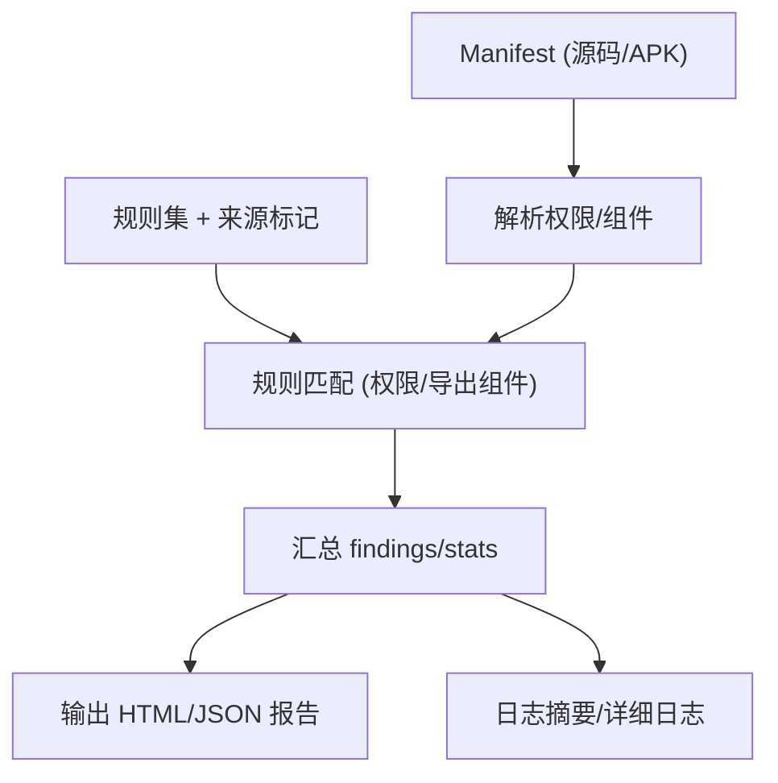

# Epic-3 - Story-1
# Manifest 与权限扫描

**As a** 隐私合规审查者/CI 用户  
**I want** 扫描 AndroidManifest 的权限与导出组件并按规则集输出风险  
**so that** 能及早发现过度索权或暴露组件的隐患

## Status

Approved

## Context

- Epic-3 聚焦静态扫描与规则引擎，本故事覆盖 Manifest/权限/导出组件检查。  
- 依赖：已完成规则供应（Epic-1）与地区/法规映射（Epic-2），获取规则并集作为扫描输入。  
- PRD 约束：报告需 HTML+JSON，标注法规与来源；日志输出摘要；支持本地/CI 运行。

## Estimation

Story Points: 2

## Tasks

1. - [ ] 设计测试用例（TDD 先行）  
   1. - [ ] 覆盖：必要性/敏感权限命中、导出组件命中、未命中、规则缺失、非法 Manifest 处理、映射来源标记透传  
   2. - [ ] 断言：命中列表（rule_id、法规、来源标记）、位置（文件/行或组件名）、严重级别、退出码与日志  
2. - [ ] 实现测试用例（自动化）  
   1. - [ ] 编写解析/匹配/报告输出的测试用例，覆盖上述场景与断言  
   2. - [ ] 支持本地与 CI 运行，验证退出码与日志内容  
3. - [ ] Manifest 解析与输入处理  
   1. - [ ] 支持 APK 解包与源码路径直接读取 Manifest  
   2. - [ ] 处理多变体/多 manifest 合并策略（至少支持主 Manifest）  
4. - [ ] 规则匹配实现  
   1. - [ ] 权限规则匹配（必要性/敏感权限）  
   2. - [ ] 导出组件规则匹配（activity/service/provider/exported 属性、权限保护）  
   3. - [ ] 关联地区/法规来源标记（来自映射/手动）  
5. - [ ] 结果与报告集成  
   1. - [ ] 输出 findings（rule_id、法规、来源、位置、证据、建议、严重级别）到 JSON/HTML  
   2. - [ ] stats 汇总：按严重级别/法规计数  
6. - [ ] 日志与可观测性  
   1. - [ ] stdout 摘要：扫描目标、命中计数、报告路径  
   2. - [ ] 详细日志：解析阶段、匹配阶段、错误与跳过原因  
7. - [ ] 文档与验收  
   1. - [ ] 示例命令（源码/ APK 输入）、预期报告片段  
   2. - [ ] 验收用例：必要权限命中、导出组件命中、无命中、异常 Manifest 处理、来源标记检查

## Constraints

- 不上传任何数据；兼容无网/受限环境。  
- 需与规则供应/映射输出的规则集与来源标记兼容。  
- 报告字段与 PRD/架构定义一致。

## Data Models / Schema

- findings 字段（示例）：

```json
{
  "rule_id": "PERM_SENSITIVE_LOCATION",
  "regulation": "PIPL",
  "source": "region",
  "severity": "high",
  "location": "AndroidManifest.xml:120",
  "evidence": "uses-permission: ACCESS_FINE_LOCATION",
  "recommendation": "仅在必要场景申请定位权限，确保前台提示与同意"
}
```

## Structure

- `scanner/manifest`：Manifest 解析与匹配模块  
- `scanner/common`：规则加载、结果汇总输出  
- `reports/`：HTML/JSON 输出目录（或 CLI 指定）

## Diagrams



## Dev Notes

- 若可用 mapping.txt，可提升定位（但此故事聚焦 Manifest）。  
- 对解析失败/缺失需给出清晰错误并不中断其他流程（除非无可用 Manifest）。  
- TDD：先写解析/匹配/输出的测试，再实现。

## Chat Command Log

- User: 生成下一个 story  
- Assistant: 起草 Epic-3 Story-1（Manifest 与权限扫描）草稿
