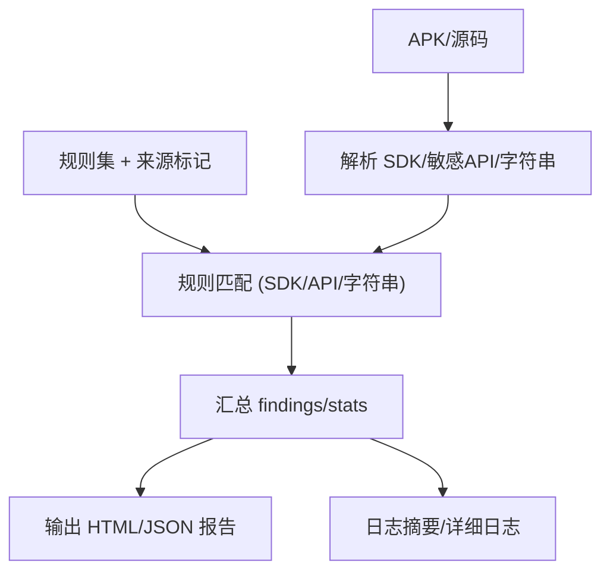

# Epic-3 - Story-2
# SDK 与敏感 API 扫描

**As a** 隐私合规审查者/CI 用户  
**I want** 识别第三方 SDK 与敏感 API/字符串，并按规则集输出风险  
**so that** 发现潜在追踪、过度收集和泄露风险，支撑整改

## Status

Approved

## Context

- Epic-3 静态扫描与规则引擎，本故事聚焦 SDK/敏感 API/字符串扫描。  
- 依赖：规则供应（Epic-1）与地区/法规映射（Epic-2）；需与 Manifest 故事输出的规则集/来源标记兼容。  
- PRD 要求：报告 HTML+JSON，标注法规与来源；支持 APK/源码输入，日志摘要。

## Estimation

Story Points: 2

## Tasks

1. - [x] 设计测试用例（TDD 先行）  
   - [x] 1.1 覆盖：已知追踪/广告 SDK 命中、敏感 API 命中、可疑域名/字符串命中、未命中、规则缺失、映射来源标记透传  
   - [x] 1.2 断言：命中列表（rule_id、法规、来源标记）、位置（文件/类/行）、严重级别、退出码与日志  
2. - [x] 实现测试用例（自动化）  
   - [x] 2.1 编写 SDK/API/字符串扫描的测试用例，覆盖命中/未命中/规则缺失等场景（已添加 xfail 骨架测试，等待实现）  
   - [x] 2.2 支持本地与 CI 运行，验证退出码与日志内容（pytest -q 已集成，当前 4 个 xfail 等待实现）  
3. - [ ] 输入与解析  
   - [ ] 3.1 支持 APK（DEX/资源/字符串）与源码（Kotlin/Java）扫描  
   - [ ] 3.2 提取 SDK 标识（包名/类名/依赖）、敏感 API 调用、字符串/域名  
4. - [ ] 规则匹配实现  
   - [ ] 4.1 SDK 列表匹配（广告/追踪等），支持扩展列表  
   - [ ] 4.2 敏感 API/字符串匹配（设备 ID/广告 ID、密钥/Token、可疑域名）  
   - [ ] 4.3 关联地区/法规来源标记  
5. - [ ] 结果与报告集成  
   - [ ] 5.1 输出 findings（rule_id、法规、来源、位置、证据、建议、严重级别）到 JSON/HTML  
   - [ ] 5.2 stats 汇总：按严重级别/法规计数  
6. - [ ] 日志与可观测性  
   - [ ] 6.1 stdout 摘要：扫描目标、命中计数、报告路径  
   - [ ] 6.2 详细日志：解析阶段、匹配阶段、错误与跳过原因  
7. - [ ] 文档与验收  
   - [ ] 7.1 示例命令（源码/APK 输入）、预期报告片段  
   - [ ] 7.2 验收用例：SDK 命中、敏感 API 命中、可疑域名命中、无命中、来源标记检查

## Constraints

- 不上传任何数据；兼容无网/受限环境。  
- 需与规则供应/映射输出的规则集与来源标记兼容。  
- 报告字段与 PRD/架构定义一致。

## Data Models / Schema

- findings 字段（示例）：

```json
{
  "rule_id": "SDK_TRACKING_001",
  "regulation": "GDPR",
  "source": "region",
  "severity": "medium",
  "location": "classes.dex:com/example/sdk/Tracker",
  "evidence": "Detected tracking SDK package com.example.sdk",
  "recommendation": "评估合法性/最小化收集，必要时提供同意与退出机制"
}
```

## Structure

- `scanner/sdk_api`：SDK/敏感 API/字符串解析与匹配模块  
- `scanner/common`：规则加载、结果汇总输出  
- `reports/`：HTML/JSON 输出目录（或 CLI 指定）

## Diagrams



## Dev Notes

- 若可用 mapping.txt，可用于类名还原；字符串扫描需控制误报（白名单/阈值）。  
- 对解析失败/缺失给出清晰错误，不阻断其他流程（除非输入不可用）。  
- TDD：先写匹配/输出的测试，再实现。

## Test Plan

- 已知追踪/广告 SDK 命中：识别包名/类名命中规则，source 透传。  
- 敏感 API 命中：设备 ID/广告 ID/敏感信息采集 API 命中，source 透传。  
- 可疑域名/字符串命中：特定域名/关键字命中，source 透传。  
- 未命中：无匹配规则时 findings 为空，stats 为零。  
- 规则缺失/加载失败：给出清晰错误或退出码，不默默失败。  
- 来源标记：findings 中 source 与映射结果一致（region/manual）。  
- 输出字段：findings 包含 rule_id/regulation/source/location/evidence/recommendation/severity；stats 按 severity/regulation 汇总。

## Assertions (for tests)

- findings：包含 rule_id、regulation、source（region/manual）、location（文件/类/行）、evidence、recommendation、severity。  
- stats：按 severity/regulation 聚合计数，与命中列表对应；未命中时为零。  
- 错误与退出码：规则缺失/输入无效等场景返回预期退出码与日志，不默默失败。  
- 来源标记：命中项的 source 与映射结果一致；手动添加的规则标记为 manual。  
- 日志摘要：包含扫描目标、命中计数、报告路径（待实现时校验）。

## Chat Command Log

- User: 生成下一个 story  
- Assistant: 起草 Epic-3 Story-2（SDK 与敏感 API 扫描）草稿
