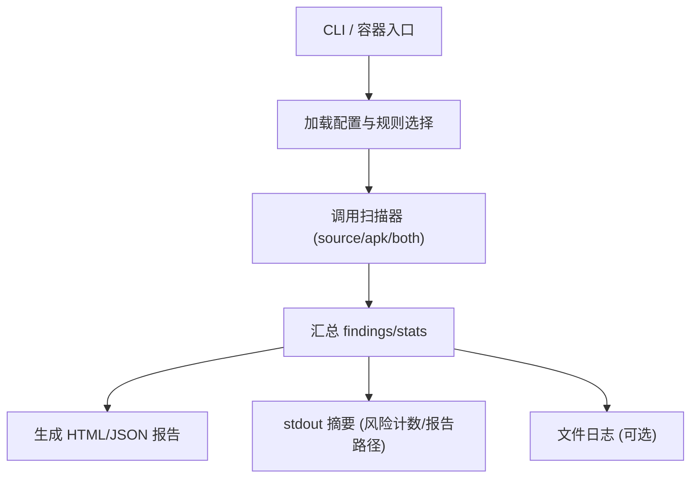

# Epic-4 - Story-1
# CLI/容器化与报告输出

**As a** CI/DevOps 用户  
**I want** 通过 CLI 与官方 Docker/OCI 镜像运行扫描，输出 HTML+JSON 报告与 stdout 摘要  
**so that** 在 CI 中快速得到可读报告与机器可消费的结果

## Status

Approved

## Context

- Epic-4 聚焦 CI 集成与报告输出。本故事涵盖 CLI 入口、容器镜像交付、报告生成与 stdout 摘要。  
- 依赖：规则供应（Epic-1）、地区/法规映射（Epic-2）、扫描能力（Epic-3）。  
- PRD 约束：报告同时输出 HTML+JSON；stdout 输出简洁摘要（风险计数、报告路径）；支持本地运行和 Docker/OCI 镜像；不设阻断策略。

## Estimation

Story Points: 2

## Tasks

1. - [x] 设计测试用例（TDD 先行）  
   - [x] 1.1 覆盖：CLI 参数解析、模式选择（source/apk/both）、输出格式 (html/json/both)、stdout 摘要内容、报告文件生成与字段校验、容器内运行示例  
   - [x] 1.2 断言：退出码、报告文件存在且符合 schema、日志摘要包含风险计数与路径、无阻断策略下不强制失败  
2. - [x] 实现测试用例（自动化）  
   - [x] 2.1 编写 CLI/报告/容器入口的测试，覆盖参数、输出、摘要、错误场景  
   - [x] 2.2 支持本地与 CI 运行，验证报告 schema、退出码与日志  
3. - [x] CLI 实现与参数解析  
   - [x] 3.1 支持 --regions/--regulations/--mode/--output-dir/--format/--timeout/--threads/--log-level/--manifest/--apk-path/--config 等  
   - [x] 3.2 处理缺少输入时的清晰错误；支持多 APK/多变体列表；源码+APK 同时提供时顺序与结果并集  
4. - [x] 报告生成与输出  
   - [x] 4.1 生成 HTML+JSON 报告，字段符合 PRD/架构 schema（meta/findings/stats）  
   - [x] 4.2 stdout 摘要：风险计数（分级）、报告路径、目标信息；可选详细日志文件  
5. - [ ] Docker/OCI 镜像与本地运行支持  
   - [ ] 5.1 提供容器入口命令，支持挂载代码/产物与输出目录；兼容无网环境使用本地规则缓存  
   - [ ] 5.2 本地直接运行说明（安装依赖后使用 CLI），行为与容器一致  
6. - [ ] 日志与可观测性  
   - [ ] 6.1 支持 log-level，文件日志可选轮转；错误/跳过原因清晰  
   - [ ] 6.2 退出码约定：成功=0，参数/运行错误=非零；不设阻断策略，风险不导致失败  
7. - [ ] 文档与验收  
   - [ ] 7.1 README/使用说明：本地与容器示例命令，输出路径说明，受限网络提示  
   - [ ] 7.2 验收用例：本地运行、容器运行、仅源码、仅 APK、同时提供、格式选择、缺少输入报错

## Constraints

- 不上传任何数据；兼容无网/受限环境。  
- 报告/日志字段需符合 PRD/架构定义；无阻断策略。  
- CLI 与容器入口行为保持一致。

## Data Models / Schema

- 报告 schema 参考 PRD/架构（meta/findings/stats），需验证 HTML/JSON 同步字段。

## Structure

- `cli/`：主入口与参数解析  
- `reports/`：报告生成模块（HTML/JSON 渲染）  
- `containers/`：Docker/OCI 镜像配置与入口脚本  
- `logs/`：日志输出（可配置路径）

## Diagrams

## Dev Notes

- 确保报告路径与 stdout 摘要中的路径一致，便于 CI 工件收集。  
- 处理多输入时的并集合并与排序规则；清晰提示缺少输入的错误。  
- TDD：先写 CLI/报告/容器入口的测试与断言，再实现。

## Test Plan（设计）

- 参数解析与模式选择：`--mode source`（仅源码）、`--mode apk`、`--mode both`；多 APK/多源码输入。  
- 输出格式：`--format html` / `--format json` / 默认 both；验证对应报告文件存在。  
- 报告字段校验：JSON/HTML 含 meta/findings/stats；统计字段与命中数一致；路径与 stdout 摘要一致。  
- stdout 摘要：包含风险计数（按严重度/法规汇总简表或数字）、报告路径、目标数量。  
- 缺少输入与错误：未提供 `--manifest/--apk-path/--input` 时返回非零退出码，打印清晰错误；不产生报告。  
- 容器运行示例：模拟 `docker run -v code:/work -v out:/out minos scan ...`，验证报告生成路径与本地一致，行为一致（不依赖网络）。  
- 无阻断策略：即便有 findings 退出码也为 0；仅参数/运行错误导致非零。  

## Assertions（for tests）

- 退出码：成功=0；缺少必要输入/参数错误=非零；findings 不能导致失败（无阻断策略）。  
- 报告文件：根据 `--format`/默认生成对应 JSON/HTML 文件，路径与 stdout 摘要一致；JSON 含 meta/findings/stats，字段类型与 schema 一致。  
- stdout 摘要：包含风险计数（severity/regulation 维度或总数）、输出报告路径、输入数量/模式；容器与本地输出一致。  
- 日志：错误/跳过原因明确（例如缺少输入/无法读取文件）；log-level 生效。  
- 容器示例：命令形如 `docker run --rm -v $PWD:/work -w /work minos scan --mode apk --apk-path app.apk --output-dir out`，报告文件在挂载目录中生成，格式与本地相同。  

## Chat Command Log

- User: 生成下一个 story  
- Assistant: 起草 Epic-4 Story-1（CLI/容器化与报告输出）草稿
