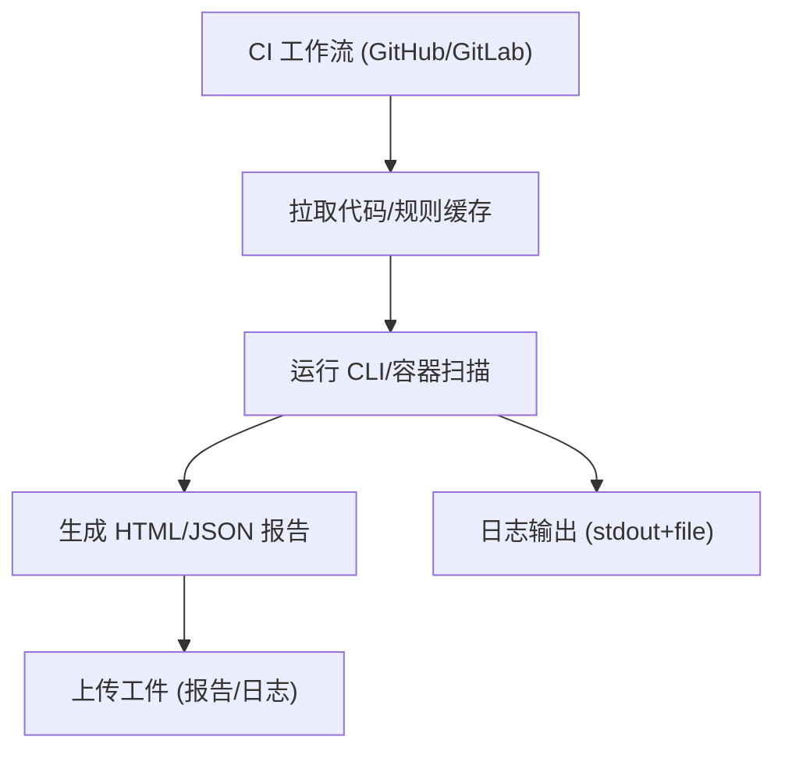

# Epic-4 - Story-3
# CI 工作流示例与工件集成

**As a** CI/DevOps 用户  
**I want** 提供可直接复用的 CI 工作流示例（GitHub Actions/GitLab CI），产出 HTML/JSON 报告和日志工件  
**so that** 团队能快速在 CI 中落地隐私合规扫描并获取结果

## Status

Approved

## Context

- Epic-4 聚焦 CI 集成与报告输出。本故事交付可复用的 CI 配置与工件收集示例。  
- 依赖：规则同步（Epic-1）、地区/法规映射（Epic-2）、扫描能力（Epic-3）、CLI/容器入口（Epic-4 Story-1）。  
- PRD 约束：报告 HTML+JSON、stdout 摘要，支持本地/容器运行，无阻断策略。

## Estimation

Story Points: 1

## Tasks

1. - [ ] 设计测试用例（TDD 先行）  
   - [ ] 1.1 覆盖：GitHub Actions 工作流、GitLab CI 工作流；产出 HTML/JSON 报告、日志工件；多输入场景（源码/APK）；缺少输入时报错  
   - [ ] 1.2 断言：步骤成功执行、工件存在且符合命名/路径约定、stdout 摘要包含风险计数/报告路径  
2. - [ ] 实现测试用例（自动化/可执行示例）  
   - [ ] 2.1 编写/配置可运行的 CI 示例测试（本地 runner/容器模拟）验证工件产出与摘要  
   - [ ] 2.2 校验退出码、工件路径、报告/schema、缺少输入报错  
3. - [ ] GitHub Actions 示例  
   - [ ] 3.1 使用官方容器镜像/本地运行方式（可选）  
   - [ ] 3.2 参数示例：地区/法规、输入路径、输出目录、log-level；缓存规则目录（可选）  
   - [ ] 3.3 上传工件：HTML/JSON 报告、日志文件  
4. - [ ] GitLab CI 示例  
   - [ ] 4.1 stage/job 配置，镜像或本地运行方式  
   - [ ] 4.2 参数示例与缓存/工件收集配置  
5. - [ ] 输出与文档  
   - [ ] 5.1 在仓库提供 `ci/` 下的示例 YAML/脚本，附运行说明  
   - [ ] 5.2 说明如何在受限网络/离线模式下使用本地规则缓存  
6. - [ ] 日志与可观测性  
   - [ ] 6.1 确保 stdout 摘要清晰；文件日志可作为工件上传  
   - [ ] 6.2 退出码约定：配置/运行错误为非零；风险不阻断（无阻断策略）

## Constraints

- 不上传业务数据；兼容无网/受限环境（使用本地规则缓存）。  
- 报告/日志字段需符合 PRD/架构定义；与 CLI 行为一致。  
- 工作流示例不强制阻断，以报告为主。

## Data Models / Schema

- 工件结构示例：`output/report.html`、`output/report.json`、`output/logs/scan.log`。

## Structure

- `ci/github-actions/`：GitHub Actions 示例 workflow  
- `ci/gitlab-ci/`：GitLab CI 示例 job  
- `scripts/`（可选）：封装运行命令的脚本

## Diagrams

## Dev Notes

- 提供最小可运行示例，路径/命名与 CLI 参数保持一致。  
- 受限网络提示：使用本地规则缓存，禁用在线 rulesync 或改用预下载。  
- TDD：先写工作流/脚本级别的验证（例如通过本地 runner/容器模拟）再交付示例。

## Chat Command Log

- User: 生成下一个 story  
- Assistant: 起草 Epic-4 Story-2（CI 工作流示例与工件集成）草稿
