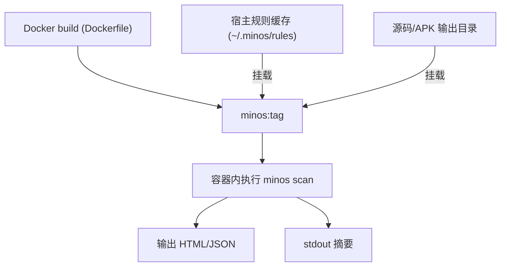

# Epic-4 - Story-2
# 容器化交付与发布

**As a** CI/DevOps 用户  
**I want** 提供可直接使用的 Docker/OCI 镜像并有验证脚本  
**so that** CI/CD 与本地能统一运行扫描并复用规则缓存

## Status

Draft

## Context

- 延续 Epic-4（CI 集成与报告输出），在 Story-1 已实现 CLI/报告基础能力。  
- 目前仅有容器入口占位和文档示例，缺少可用镜像（Dockerfile）、依赖安装、构建/推送流程与容器内验收。  
- 目标：本地与 CI 均可通过官方镜像运行扫描（含规则缓存挂载），输出 HTML+JSON 报告与 stdout 摘要。

## Estimation

Story Points: 3

## Tasks

1. - [x] 设计与实现测试（TDD 先行）  
   - [x] 1.1 设计容器化验收：构建镜像、运行 smoke（source 模式、apk 模式）、报告生成与摘要校验、无网缓存挂载场景  
   - [x] 1.2 实现自动化测试/脚本（或 CI 示例）验证镜像可用性与退出码  
2. - [x] Docker/OCI 镜像构建  
   - [x] 2.1 Dockerfile：基础镜像（python 3.10+，含 unzip/zip，必要时 openjdk 17）、安装依赖、复制源码、设置工作目录/ENTRYPOINT  
   - [x] 2.2 支持构建参数（PIP_INDEX_URL/HTTP_PROXY 等），预置规则缓存目录（空），ENTRYPOINT 使用 containers/entrypoint.sh  
3. - [x] 容器运行与缓存策略  
   - [x] 3.1 规则缓存挂载约定（默认 /root/.minos/rules），无网时示例命令；确保写权限  
   - [x] 3.2 输出目录挂载与权限（/work/output/reports），与 CLI 保持一致  
4. - [x] 容器验收与 smoke 测试  
   - [x] 4.1 在容器内运行 `minos scan --mode source` 示例，验证 JSON/HTML 报告与 stdout 摘要  
   - [x] 4.2 在容器内运行 apk 模式的占位 smoke，验证缺少输入时返回非零、错误提示清晰  
   - [x] 4.3 （可选）CI 示例脚本：构建镜像 + 运行 smoke，生成工件  
5. - [x] 文档与发布  
   - [x] 5.1 更新 README/containers/README：构建命令、运行示例、规则缓存挂载、受限网络提示、标签/发布约定  
   - [x] 5.2 标注镜像标签策略（如与 git tag 同步），占位推送命令（docker push/oci），列出依赖/体积注意事项  

## Constraints

- 兼容无网/受限网络：规则缓存需可挂载；镜像不强依赖外部拉取。  
- 保持与现有 CLI/报告格式一致；不上传扫描数据。  
- 容器执行需在非特权环境可运行，尽量避免 root-only 操作。

## Structure

- `containers/Dockerfile`：镜像构建脚本  
- `containers/entrypoint.sh`：入口（已有，占位），需在 Dockerfile 中引用  
- `containers/README.md`：容器使用/构建说明  
- `scripts/`（可选）：容器 smoke/CI 示例

## Diagrams

## Dev Notes

- 基础镜像推荐 slim 以减小体积；若需要 JDK 可选择带 JRE 的变体或安装 openjdk-17-jre-headless。  
- 统一工作目录 /work，ENTRYPOINT 调用 `python -m minos.cli`，允许覆盖 CMD。  
- Smoke 测试可使用现有示例源码/假 APK，关注退出码与报告路径。  
- TDD：先写容器 smoke 测试/脚本，再补 Dockerfile 与文档。  
- 已添加 `scripts/container_smoke.sh`：构建镜像并运行一次源码模式扫描，生成 JSON 报告，验证退出码。  
- 已添加 `scripts/container_ci_example.sh`：CI 示例构建镜像并运行源码模式，输出到 output/reports 作为工件。  

## 验收设计（1.1）

- 构建镜像：`docker build -t minos:test .`（可接受 ARG 覆盖代理源）。  
- Smoke-源码模式：`docker run --rm -v $PWD:/work -w /work minos:test minos scan --mode source --input tests --output-dir output/reports --format json`，期望退出码=0、生成 JSON 报告、stdout 摘要含 by_reg/by_sev。  
- Smoke-APK 模式（占位）：`docker run --rm -v $PWD:/work -w /work minos:test minos scan --mode apk --apk-path tests/fixtures/dummy.apk --format json`，缺少文件时应非零退出且 stderr 给出缺少输入提示。  
- 无网缓存挂载：`-v ~/.minos/rules:/root/.minos/rules` 挂载后依旧可运行 smoke（不校验网络访问）。  
- 输出路径一致性：容器与本地均在 /work/output/reports 下生成报告；日志（如指定 --log-file）可写入挂载目录。  

## Chat Command Log

- User: 新建 story 用来实现容器化交付，并更新相关文档。参考模板，遵循 TDD。  
