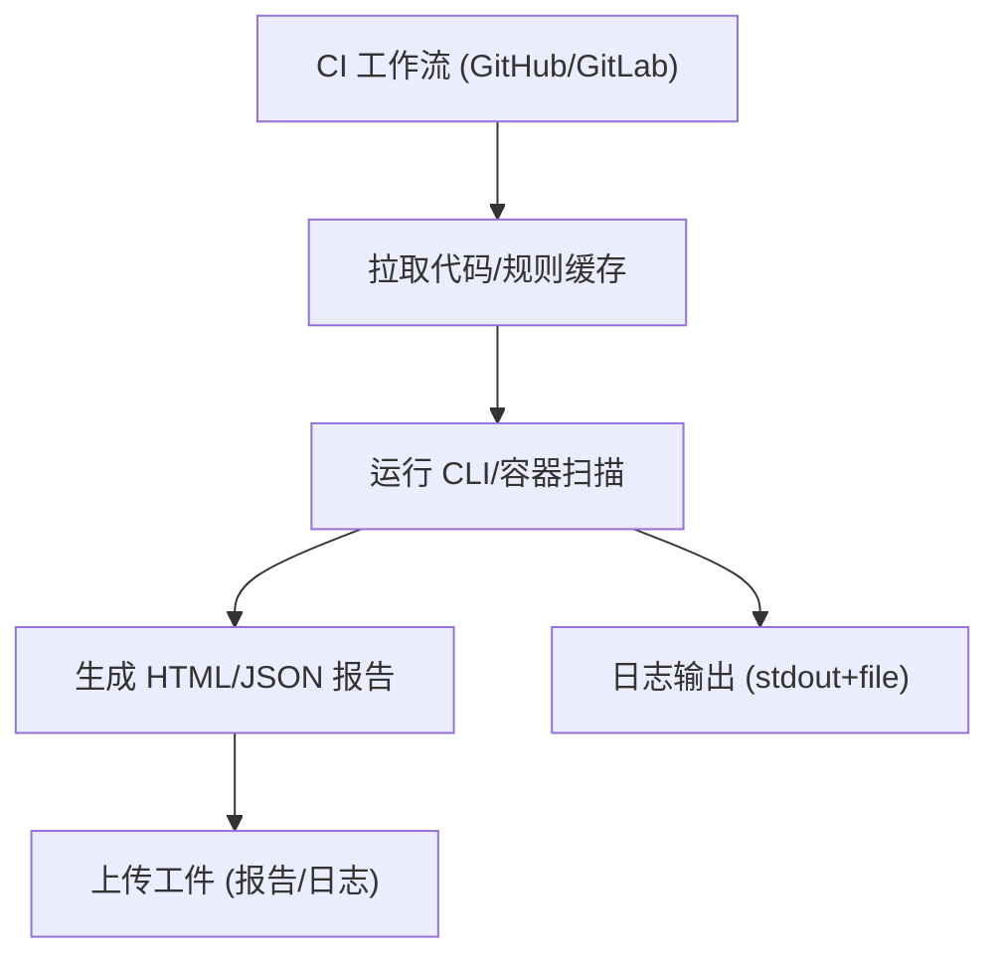

# Epic-4 - Story-3
# CI 工作流示例与工件集成

**As a** CI/DevOps 用户  
**I want** 提供可直接复用的 CI 工作流示例（GitHub Actions/GitLab CI），产出 HTML/JSON 报告和日志工件  
**so that** 团队能快速在 CI 中落地隐私合规扫描并获取结果

## Status

Approved

## Context

- Epic-4 聚焦 CI 集成与报告输出。本故事交付可复用的 CI 配置与工件收集示例。  
- 依赖：规则同步（Epic-1）、地区/法规映射（Epic-2）、扫描能力（Epic-3）、CLI/容器入口（Epic-4 Story-1）。  
- PRD 约束：报告 HTML+JSON、stdout 摘要，支持本地/容器运行，无阻断策略。

## Estimation

Story Points: 1

## Tasks

1. - [x] 设计测试用例（TDD 先行）  
   - [x] 1.1 覆盖：GitHub Actions 工作流、GitLab CI 工作流；产出 HTML/JSON 报告、日志工件；多输入场景（源码/APK）；缺少输入时报错  
   - [x] 1.2 断言：步骤成功执行、工件存在且符合命名/路径约定、stdout 摘要包含风险计数/报告路径  
2. - [ ] 实现测试用例（自动化/可执行示例）  
   - [ ] 2.1 编写/配置可运行的 CI 示例测试（本地 runner/容器模拟）验证工件产出与摘要  
   - [ ] 2.2 校验退出码、工件路径、报告/schema、缺少输入报错  
3. - [ ] GitHub Actions 示例  
   - [ ] 3.1 使用官方容器镜像/本地运行方式（可选）  
   - [ ] 3.2 参数示例：地区/法规、输入路径、输出目录、log-level；缓存规则目录（可选）  
   - [ ] 3.3 上传工件：HTML/JSON 报告、日志文件  
4. - [ ] GitLab CI 示例  
   - [ ] 4.1 stage/job 配置，镜像或本地运行方式  
   - [ ] 4.2 参数示例与缓存/工件收集配置  
5. - [ ] 输出与文档  
   - [ ] 5.1 在仓库提供 `ci/` 下的示例 YAML/脚本，附运行说明  
   - [ ] 5.2 说明如何在受限网络/离线模式下使用本地规则缓存  
6. - [ ] 日志与可观测性  
   - [ ] 6.1 确保 stdout 摘要清晰；文件日志可作为工件上传  
   - [ ] 6.2 退出码约定：配置/运行错误为非零；风险不阻断（无阻断策略）

## Constraints

- 不上传业务数据；兼容无网/受限环境（使用本地规则缓存）。  
- 报告/日志字段需符合 PRD/架构定义；与 CLI 行为一致。  
- 工作流示例不强制阻断，以报告为主。

## Data Models / Schema

- 工件结构示例：`output/report.html`、`output/report.json`、`output/logs/scan.log`。

## Structure

- `ci/github-actions/`：GitHub Actions 示例 workflow  
- `ci/gitlab-ci/`：GitLab CI 示例 job  
- `scripts/`（可选）：封装运行命令的脚本

## Diagrams

## Dev Notes

- 提供最小可运行示例，路径/命名与 CLI 参数保持一致。  
- 受限网络提示：使用本地规则缓存，禁用在线 rulesync 或改用预下载。  
- TDD：先写工作流/脚本级别的验证（例如通过本地 runner/容器模拟）再交付示例。

## Test Plan（设计）

- GitHub Actions 工作流：通过 `act`（或等效本地 runner 脚本）执行 `ci/github-actions/*.yml`，验证源码模式成功生成 `output/reports/report.html`、`output/reports/report.json` 与 `output/logs/scan.log`，stdout 摘要含风险计数和报告路径；覆盖使用容器镜像运行 CLI、挂载本地规则缓存的场景。  
- GitHub Actions 多输入/格式：使用同一 workflow 运行同时传入源码目录与 APK 路径的 job，断言生成的 HTML/JSON 报告聚合两类输入，格式选择 `--format json` 时仅产出 JSON。  
- GitHub Actions 缺少输入报错：提供缺省 `--input/--apk-path` 的 job，预期步骤失败、退出码非零，stderr/日志提示缺少输入，不上传空工件。  
- GitLab CI 工作流：使用 `gitlab-runner exec docker`（或模拟脚本）执行 `ci/gitlab-ci/*.yml`，验证 stage/job 能拉起容器或本地环境运行 CLI，产出同路径工件并通过 `artifacts: paths` 上传。  
- GitLab CI 多输入/格式：job 覆盖源码/APK/双输入，分别断言生成 HTML/JSON、日志工件，stdout 摘要含风险计数与报告路径。  
- GitLab CI 缺少输入报错：job 中刻意缺参数或指向不存在的 APK，runner 返回非零且日志包含缺少输入提示，工件目录保持为空。

## Assertions（工作流验证）

- 退出码：成功路径 job/step 退出码=0；缺少输入或参数错误时非零并中止上传工件。  
- 报告工件：`output/reports/report.html` 与 `output/reports/report.json` 按 `--format` 存在且非空，命名与 PRD 路径一致。  
- 日志工件：`output/logs/scan.log`（或 workflow 配置的日志路径）存在且包含阶段信息、错误/缺少输入提示。  
- Stdout 摘要：包含风险计数（按 severity/数量）、报告路径；在多输入场景摘要中反映输入数量/模式（source/apk/both）。  
- 缓存/挂载：当指定规则缓存目录挂载时，工作流仍能生成报告且不因网络受限失败；日志显示使用本地缓存。  
- 工件上传：GitHub Actions `actions/upload-artifact` 与 GitLab CI `artifacts: paths` 均成功收集上述文件；若步骤失败则不上传空工件。  
- 环境一致性：容器与本地运行方式的报告路径、摘要格式保持一致，且工作目录/输出目录在 CI 与本地一致（`/work/output/reports`）。

## Chat Command Log

- User: 生成下一个 story  
- Assistant: 起草 Epic-4 Story-2（CI 工作流示例与工件集成）草稿  
- User: [story-7.story.md](.ai/stories/story-7.story.md) 执行任务1.1  
- Assistant: 设计任务 1.1 的测试覆盖方案
- User: 执行任务1.2  
- Assistant: 设计任务 1.2 的断言并勾选完成
- User: 标记任务1完成  
- Assistant: 标记 Story-3 任务 1 完成
