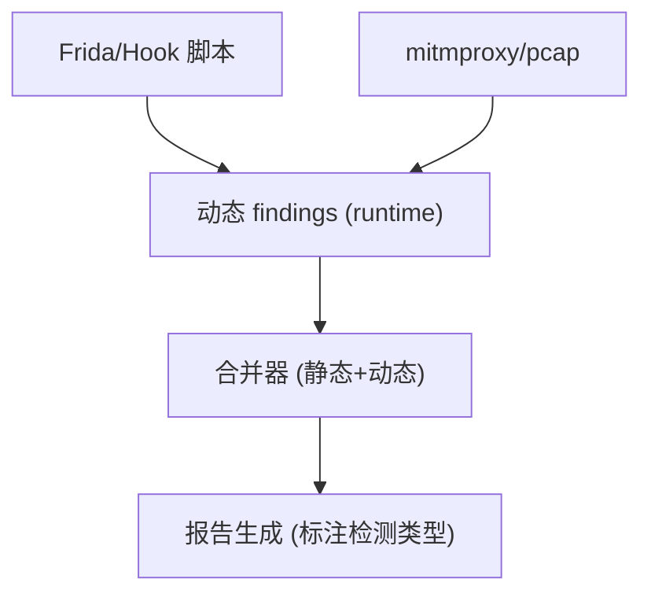

# Epic-N - Story-1
# 动态流量与运行时检测预研（Frida/mitmproxy 接口预留）

**As a** 合规/安全研究员  
**I want** 预研动态检测方案（Frida Hook 与 mitmproxy 流量抓取）的接口与集成路径  
**so that** 为后续版本提供可插拔的运行时与流量检测能力

## Status

Approved

## Context

- Epic-N 为后续迭代，当前仅做预研与接口定义，不在首版发布范围。  
- 目标：界定可插拔的运行时（Frida/Xposed）与流量检测（mitmproxy/pcap）接口，定义输出格式与与静态结果的合并策略。  
- 需与 PRD 的规则数据驱动、报告字段、日志要求保持一致；不破坏现有 CI 流程（可放 nightly 或独立任务）。

## Estimation

Story Points: 1

## Tasks

1. - [x] 设计预研用例（TDD 先行，偏设计验收）  
   - [x] 1.1 覆盖：Frida Hook 输出格式、mitmproxy 流量标签、与静态 findings 合并、错误与超时处理  
   - [x] 1.2 断言：接口返回 schema、合并后报告字段一致性、退出码与日志规范  
2. - [x] 实现测试用例/样例（自动化或可运行样例）  
   - [x] 2.1 提供 schema 校验、合并逻辑的自动化测试或可运行样例（含动态/静态合并）  
   - [x] 2.2 覆盖错误/超时/无输出等场景的断言  
3. - [x] 定义动态检测插件接口  
   - [x] 3.1 插件元数据（名称、版本、支持的 hook/流量类型）  
   - [x] 3.2 输入/输出 schema（与静态 findings 兼容：rule_id/位置/证据/严重级别/来源标记）  
   - [x] 3.3 生命周期与运行模式（nightly/独立 CI job），超时与失败策略  
4. - [x] 预研 Frida 集成路径  
   - [x] 4.1 如何注入/启动 Frida server、脚本示例、常见反调试绕过思路（记录，不实现）  
   - [x] 4.2 Hook 重点：敏感 API 调用、标识收集、出网目标；输出映射到 findings 格式  
5. - [ ] 预研 mitmproxy/流量捕获路径  
   - [ ] 5.1 代理/证书注入、受 TLS Pinning 影响的绕过思路（记录，不实现）  
   - [ ] 5.2 PII/ID/域名识别规则与标签；输出映射到 findings 格式  
6. - [ ] 合并与报告策略  
   - [ ] 6.1 动态 findings 与静态 findings 的合并规则（去重、优先级、来源标记=dynamic）  
   - [ ] 6.2 报告新增字段：检测类型（static/dynamic）、时间戳、会话 ID（可选）  
7. - [ ] 文档与验收  
   - [ ] 7.1 预研结论文档：接口定义、样例输出、限制与风险（反调试、证书校验、自动化成本）  
   - [ ] 7.2 验收：接口 schema 评审通过，样例输出与合并策略明确

## Constraints

- 不在首版交付范围，不破坏现有 CI 路径；可作为 nightly/独立任务。  
- 不上传业务数据；预研输出仅为接口定义与样例。  
- 与现有报告/日志/规则格式兼容（字段一致）。

## Data Models / Schema

- 动态检测输出示例：

```json
{
  "type": "dynamic",
  "source": "frida",
  "rule_id": "RUNTIME_ID_ACCESS",
  "regulation": "GDPR",
  "severity": "medium",
  "location": "com.example.MainActivity#getDeviceId()",
  "evidence": "IMEI accessed at runtime",
  "timestamp": "2024-01-01T00:00:00Z",
  "session": "run-001"
}
```

## Structure

- `dynamic/interfaces/`：插件接口与 schema 定义  
- `dynamic/samples/`：示例 Frida/mitmproxy 输出  
- `docs/dynamic-prestudy.md`：预研结论与限制

## Diagrams



## Dev Notes

- 聚焦接口与格式，不落实现码；记录绕过与限制，作为后续开发参考。  
- TDD：以 schema/合并逻辑的测试与样例输出作为验收基线。

## Test Plan（设计）

- Frida Hook 输出：样例 JSON 含 `type=dynamic`、`source=frida`、`rule_id/region/severity/location/evidence/timestamp/session`，覆盖敏感 API Hook（ID/网络/位置）。  
- mitmproxy 输出：流量条目含 `source=mitmproxy`、`pii_tags`、`domains`、`session/request_id`，区分明文/加密与证书校验结果，标注 TLS Pinning 绕过状态。  
- 合并逻辑：静态 findings + 动态 findings 去重（rule_id+location），动态来源标记 `detection_type=dynamic`，并集统计汇总保持 schema 一致（meta/findings/stats）。  
- 错误与超时：无输出/超时/异常时返回非零或标注 `status=error`，日志包含错误原因，报告中不生成空 findings。  
- 输出格式：定义共用 JSON schema（动态/静态共用字段+动态扩展），确保可与现有报告生成兼容。

## Assertions（设计）

- Schema：接口/样例输出必须符合统一 JSON schema（字段：type/source/rule_id/regulation/severity/location/evidence/timestamp/session/status），静态/动态字段并集兼容现有报告 meta/findings/stats。  
- 合并一致性：合并后报告保持 meta/findings/stats 三段，findings 标记 `detection_type=static|dynamic`，去重键=rule_id+location+source；stats 汇总包含动态来源的计数。  
- 退出码：接口/脚本成功返回 0；缺少输入、超时或解析失败返回非零；存在 findings 不导致失败（无阻断）。  
- 日志规范：日志必须包含阶段信息（hook 启动/流量截获/合并）、错误原因（缺少输出/超时）、输出路径；stdout 摘要包含 dynamic/static 计数与报告路径。  
- 错误场景：Frida 未连接/mitmproxy 无流量时应记录 warning 或 error，并返回非零退出码或显式 status=error，且不输出空 findings；超时应中止并给出超时提示。

## Chat Command Log

- User: 生成下一个 story  
- Assistant: 起草 Epic-N Story-1（动态流量与运行时检测预研）草稿  
- User: [story-8.story.md](.ai/stories/story-8.story.md) 执行任务1.1  
- Assistant: 设计动态检测预研覆盖用例并勾选 1.1  
- User: 执行任务1.2  
- Assistant: 补充断言（schema/合并/退出码/日志）并勾选 1.2  
- User: 标记任务1完成  
- Assistant: 标记 Story-8 任务 1 完成
- User: 执行任务2.1  
- Assistant: 提供动态/静态合并可运行样例并勾选 2.1
- User: 执行任务2.2  
- Assistant: 为错误/无输出场景补充校验用例并勾选 2.2
- User: 执行任务3.1  
- Assistant: 添加动态插件元数据说明与输出 schema 并勾选 3.1
- User: 执行任务3.2  
- Assistant: 补充输入/输出 schema（兼容静态字段，含错误场景）并勾选 3.2
- User: 标记任务3完成  
- Assistant: 标记 Story-8 任务 3 完成
- User: 执行任务4.1  
- Assistant: 在 docs/dynamic-prestudy.md 记录 Frida 启动/反调试绕过思路并勾选 4.1
- User: 执行任务4.2  
- Assistant: 补充 mitmproxy/流量预研输出映射并勾选 4.2  
- User: 标记任务4完成  
- Assistant: 标记 Story-8 任务 4 完成
